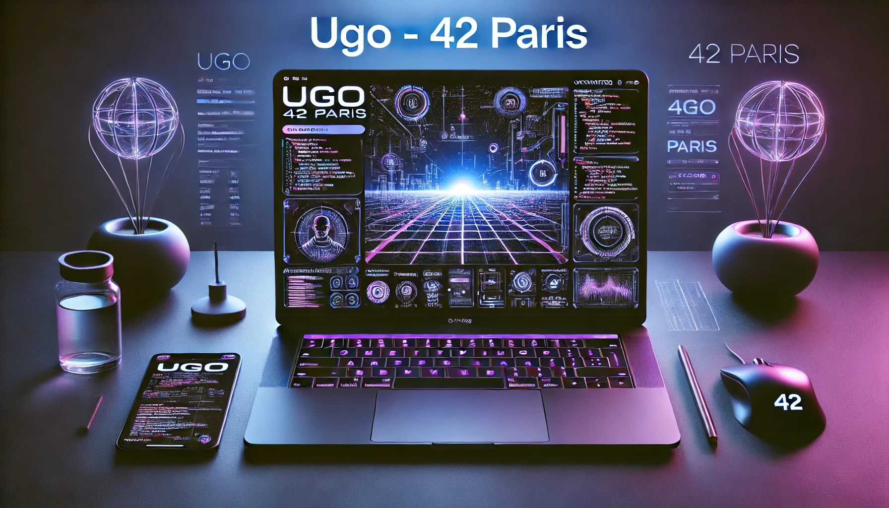

<!-- Heading -->
 
<h1 align="center">
  

  

  

  

  

<!--Skills Section-->
<h1 align="center">
   
   
  
</h1>

  

    <h3>🌍 Languages</h3>
    

      
    

    
<em>Mastering core languages like C, C++, Python.</em>

  

  

    <h3>🎨 Front-End</h3>
    

      
    

    
<em>Building sleek and responsive interfaces.</em>

  

  

    <h3>💻 Back-End</h3>
    

      
    

    
<em>Creating robust back-end systems.</em>

  

  

    <h3>🛠️ Tools</h3>
    

      
    

    
<em>Leveraging tools like Docker, Git & VSCode.</em>

  

 

<!--Projects-->
<h1 align="center">
    
   
  
</h1>

  <!-- Left Side: 42 Projects -->
  

    <h2>42 Projects</h2>
    <!-- In Progress Projects -->
    <h3>In Progress</h3>
    

      
      
      
    

    <!-- Finished Projects -->
    <h3>Finished</h3>
    

      
      
      
      
      
      
      
      
      
      
      
    

  

  <!-- Right Side: External Projects -->
  

    <h2>External Projects</h2>
    

      <h3>Coming Soon</h3>
    

  

 

<!--GitHub stats-->
<h1 align="center">
    
   
  
</h1>

  
  

 

<!--Contact-->
<h3 align="center">Let's contribute together!</h3>

Feel free to submit issues, PRs, or just contact me if you want to collaborate on a project. Together we can build amazing things. 🚀

  <a href="ugozanchi5@gmail.com">📧 Contact</a>

